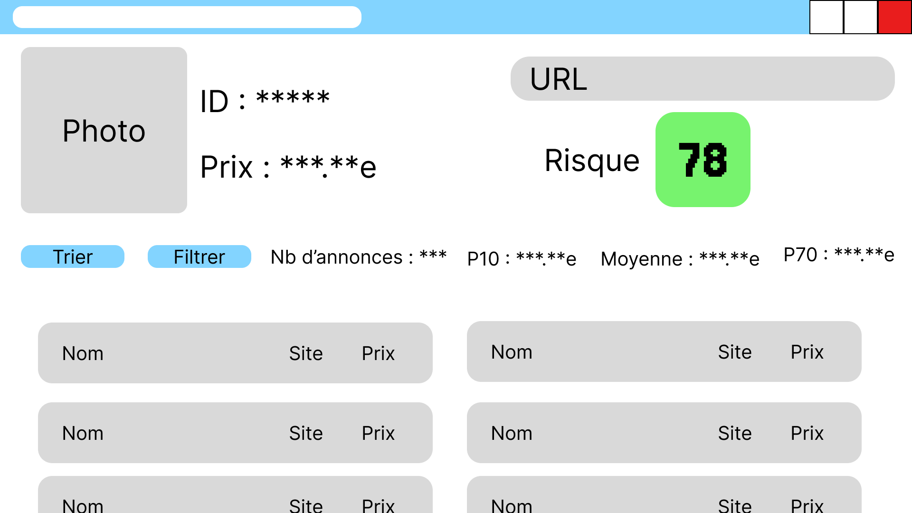

# Design Review

## Low-fidelity sketches

## List of taken considerations for sketches/design

## Main problem we are solving for

## Measures of the success

## List of visual aspects convictions

## List of interaction patterns convictions

